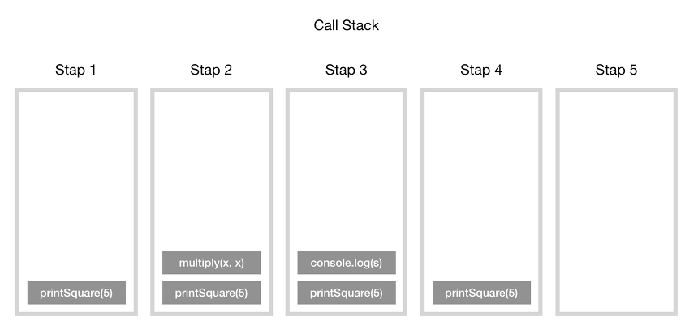
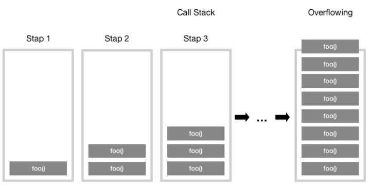
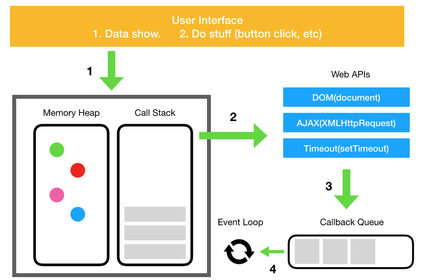

## 1. Javascript 실행순서


### 1. 동기(Synchronous: 동시에 일어나는)

-   요청과 그 결과가 동시에 일어난다는 약속
-   바로 요청을 하면 시간이 얼마나 걸리던지 <code>요청한 자리</code>에서 결과가 주어져야 함
-   <code>순서에</code> 맞춰 진행되는 장점이 있지만,  여러 가지 요청을 동시에 처리할 수 없다.

### 2. 비동기(Asynchronous: 동시에 일어나는 않는)

-   요청과 결과가 동시에 일어나지 않을 거라는 약속
-   하나의 요청에 따른 응답을 즉시 처리하지 않아도, 그 대기 시간동안 또 <code>다른 요청에 대해 처리 가능</code>한 방식
-   <code>여러 개의 요청을 동시에 처리</code>할 수 있는 장점이 있지만 동기 방식보다 속도가 떨어질 수도 있다.

### 3. 동기와 비동기 장단점

-   <code>동기방식</code> 은 설계가 매우 간단하고 직관적이지만 결과가 주어질 때까지 아무것도 못하고 대기해야 하는 단점

-   <code>비동기방식</code> 은 동기보다 복잡하지만 결과가 주어지는데 시간이 걸리더라도 그 시간 동안 작업을 할 수 있으므로 자원을 효율적으로 사용할 수 있는 장점이 있다.

<br/>

## 2. Callstack (호출 스택)


#### 자바스크립트 엔진

브라우저는 DOM, AJAX, setTimeout 등의 브라우저에서 제공하는 Web API, Web API의 호출을 통제하기 위한 Event Queue와 Event Loop도 존재

#### 메모리 힙(Memory Heap)

-   <code>객체는 힙</code>, 대부분 구조화되지 않은 메모리 영역에 할당및 저장
-   <code>변수와 객체에 대한 모든 메모리 할당</code>은 여기서 발생

### 호출 스택(Call Stack)

-   코드가 실행될 때 호출 스택에 함수들이 차례대로 쌓이며 실행
-   자바스크립트는 단일 스레드 프로그래밍 언어, <code>단일 호출 스택</code>은 한 번에 하나의 일(Task)만 처리할 수 있다. (stack은 마지막에 들어온 것이 가장 먼저 처리)

```jsx
function multiply(x, y) {
    return x * y;
}
function printSquare(x) {
    var s = multiply(x, x);
    console.log(s);
}
printSquare(5);
```

-   호출 스택의 각 항목을 스택 프레임이라고 한다.
    

### 예외 처리 시 스택의 동작

예외가 던져질 때 스택의 호출이 어떤 순서로 일어나는지 알려줌

```jsx
function foo() {
    throw new Error('SessionStack will help you resolve crashes :)');
}
function bar() {
    foo();
}
function start() {
    bar();
}
start();
```

-   아래와 같은 순서로 에러가 발생
    

### 스택 오버플로우

택의 사이즈를 초과 했을 때 발생하는 오류, 재귀를 호출했을 때 쉽게 확인 가능

```jsx
function foo() {
    foo();
}
foo();
```


-   호출 스택의 함수 호출 수가 호출 스택의 실제 크기를 초과하게 되고, 브라우저는 다음과 같은 오류를 발생시키는 것으로 함수를 종료 시킴
    
    <code></code>

<br/>

## 3. Callback (비동기 콜백)

### 콜백 함수란 ?

-   비동기 콜백은 일부 코드를 즉시 실행하지 않고 나중에 실행하도록 예약하는 방식
-   이러한 콜백 함수는 특정 이벤트가 발생하거나 일정 시간이 지난 후 실행

### 이벤트 큐와 비동기 콜백의 처리 과정

JavaScript 런타임은 이벤트 큐(Event Queue)를 사용하여 비동기 콜백을 관리합니다. 이벤트 큐는 처리할 메시지와 실행할 콜백 함수들을 저장하는 곳



1. 버튼 클릭, HTTP 요청, setTimeout 등과 같은 이벤트가 발생하면, 해당 비동기 함수는 C++로 구현된 Web API를 호출합니다.
2. Web API는 콜백 함수를 이벤트 큐에 전달합니다.
3. 이벤트 큐는 콜 스택이 비는 시점을 기다립니다.
4. 콜 스택이 비면 이벤트 루프(Event Loop)가 이벤트 큐에서 콜백을 가져와 콜 스택에 추가합니다.
5. 콜백 함수가 실행됩니다.

#### <code>이벤트 루프</code>의 기본 역할은 이벤트 큐와 콜 스택을 지속적으로 모니터링하여, 콜 스택이 비는 시점에 이벤트 큐에서 콜백을 실행시키는 것

<br/>

## 4. Promise

### Promise란?

-   Promise는 비동기 작업의 최종 완료 또는 실패를 나타내는 객체
-   현재는 처리되지 않았지만 미래에 완료될 작업
-   콜백 지옥(callback hell)을 피하고, 더 읽기 쉽고 관리하기 쉬운 비동기 코드를 작성

### Promise 상태 (states)

new Promise()로 프로미스를 생성하고 종료될 때까지 3가지 상태

-   <code>Pending</code>(대기) : 비동기 처리 로직이 아직 완료되지 않은 상태
-   <code>Fulfilled</code>(이행) : 비동기 처리가 완료되어 프로미스가 결과 값을 반환해준 상태
-   <code>Rejected</code>(실패) : 비동기 처리가 실패하거나 오류가 발생한 상태
